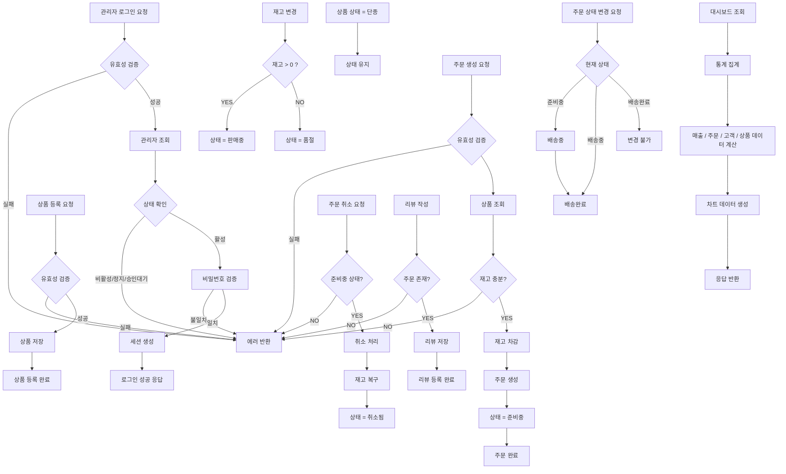
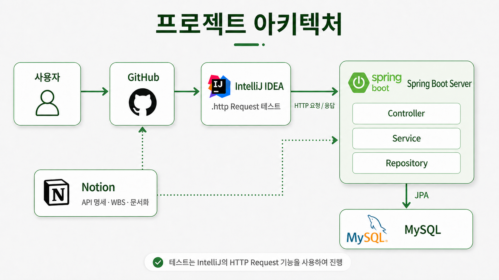
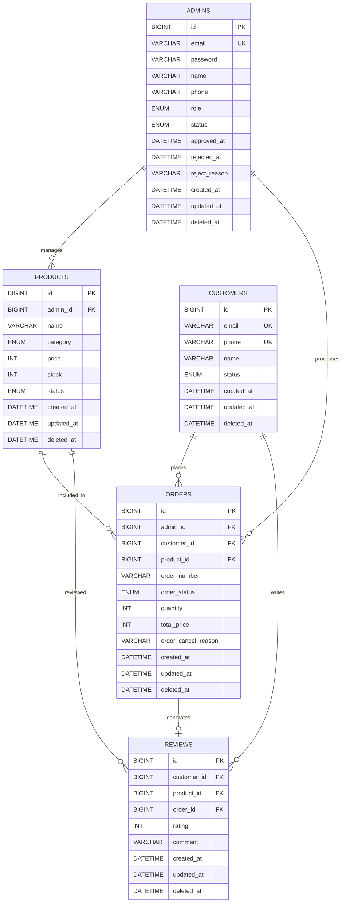

# 🛒 EcommerceBackOfficeProject

Spring 기반의 고객 및 상품 관리 시스템입니다.

## 코드 컨벤션

### [코드 컨벤션 문서 링크](docs/codeConvention.md)

## GitHub Rules

### [GitHub Rules 문서 링크](docs/gitHubRules.md)

## 비즈니스 로직 플로우 차트



## 개발 환경

- **Language:** Java 17
- **Framework & Environment:**
    - **Spring Boot 4**
    - **Spring Data JPA**
    - **Bean Validation**
- **Database:** MySQL
- **Security:**
    - **BCrypt**
- **Tools:** Postman

## 패키지 구조

<details>
<summary>패키지 구조 확인</summary>



```
ecommercebackofficeproject
├─ admin
│  ├─ controller
│  ├─ dto
│  │  ├─ request
│  │  └─ response
│  ├─ entity
│  ├─ repository
│  ├─ service
│  └─ type
├─ auth
│  ├─ controller
│  ├─ dto
│  ├─ jwt
│  └─ service
├─ customer
│  ├─ controller
│  ├─ dto
│  │  ├─ request
│  │  └─ response
│  ├─ entity
│  ├─ repository
│  ├─ service
│  └─ type
├─ dashboard
│  ├─ controller
│  ├─ dto
│  └─ service
├─ global
│  ├─ common
│  ├─ config
│  ├─ exception
│  ├─ response
│  └─ security
├─ order
│  ├─ controller
│  ├─ dto
│  │  ├─ request
│  │  └─ response
│  ├─ entity
│  ├─ repository
│  ├─ service
│  └─ type
├─ product
│  ├─ controller
│  ├─ dto
│  │  ├─ request
│  │  └─ response
│  ├─ entity
│  ├─ repository
│  ├─ service
│  └─ type
└─ review
   ├─ controller
   ├─ dto
   │  └─ response
   ├─ entity
   ├─ repository
   └─ service
```

</details>

### 패키지 역할

`admin`

<details>

<summary>관리자 도메인 핵심 패키지</summary>

- 관리자 가입 신청 / 승인 / 거부 / 상태 변경 / 역할 변경 / 삭제 / 조회
- 관리자 상태(승인대기, 활성, 정지 등) 및 역할(슈퍼, 운영, CS) 관련 비즈니스 로직 처리

</details>

`auth`

<details>

<summary>인증(Authentication) 및 세션 관리 담당</summary>

- 로그인 / 로그아웃 처리
- 세션 저장 (관리자 ID, 이메일, 역할)
- 쿠키 기반 인증 (HttpOnly)
- PasswordEncoder, 인증 검증 로직 포함
- “로그인 가능 상태 체크” (활성만 허용)

</details>

`customer`

<details>
<summary>고객 도메인 관리 패키지</summary>

- 고객 조회 / 수정 / 상태 변경 / 삭제
- 고객 리스트 + 상세 조회 + 페이징 + 필터링
- 고객 상태(활성, 비활성, 정지) 관리
- 고객별 주문 통계 집계 처리

</details>

`dashboard`

<details>

<summary>통계 및 집계 전용 패키지</summary>

- 전체 시스템 요약 데이터 / 위젯 / 차트 데이터 제공
- 매출, 주문 상태 분포, 고객 상태 분포, 카테고리 통계 등
- 최근 주문 조회

</details>

`global`

<details>
<summary>전역 공통 기능 패키지</summary>
- 공통 응답 포맷
- 전역 예외 처리
- 공통 BaseEntity
- 인터셉터, 필터, 설정(Config)
</details>

`order`

<details>
<summary>주문 도메인 핵심 패키지</summary>
- 주문 생성 / 조회 / 상태 변경 / 취소
- 주문 상태 흐름 관리
- 주문 생성 시 재고 차감 / 총 금액 계산 / 주문번호 생성
</details>

`product`

<details>
<summary>상품 도메인 관리 패키지</summary>
- 상품 등록 / 조회 / 수정 / 삭제
- 재고 관리 + 상태 자동 변경
- 단종 상태 예외 처리
- 카테고리 / 가격 / 상태 필터링 기능
</details>

`review`

<details>
<summary>리뷰 도메인 관리 패키지</summary>
- 리뷰 조회 / 상세 조회 / 삭제
- 평점 기반 필터링 및 정렬
- 상품 상세에서 리뷰 통계 제공
- 관리자 리뷰 관리 기능
</details>

## ERD



## API 요약

### 인증

#### [인증 API 문서 링크](docs/auth/README.md)

### 관리자

#### [관리자 API 문서 링크](docs/admin/README.md)

### 고객

#### [고객 API 문서 링크](docs/customer/README.md)

### 상품

#### [상품 API 문서 링크](docs/product/README.md)

### 리뷰

#### [리뷰 API 문서 링크](docs/review/README.md)

### 주문

#### [주문 API 문서 링크](docs/order/README.md)

### 대시보드

#### [대시보드 API 문서 링크](docs/dashboard/README.md)

### 공통 로직 관리

#### [공통 로직 API 문서 링크](docs/global/README.md)

## 트러블 슈팅 내용

### [1. 로그인 여부 확인 로직 공통화와 Interceptor 적용](https://github.com/gpekd5/ecommerce-backoffice-project/wiki/%5BTroubleShooting%5D-%EB%A1%9C%EA%B7%B8%EC%9D%B8-%EC%97%AC%EB%B6%80-%ED%99%95%EC%9D%B8-%EB%A1%9C%EC%A7%81-%EA%B3%B5%ED%86%B5%ED%99%94%EC%99%80-Interceptor-%EC%A0%81%EC%9A%A9)

### [2. GlobalExceptionHandler를 통한 예외 처리 공통화](https://github.com/gpekd5/ecommerce-backoffice-project/wiki/%5BTroubleShooting%5D-GlobalExceptionHandler%EB%A5%BC-%ED%86%B5%ED%95%9C-%EC%98%88%EC%99%B8-%EC%B2%98%EB%A6%AC-%EA%B3%B5%ED%86%B5%ED%99%94)